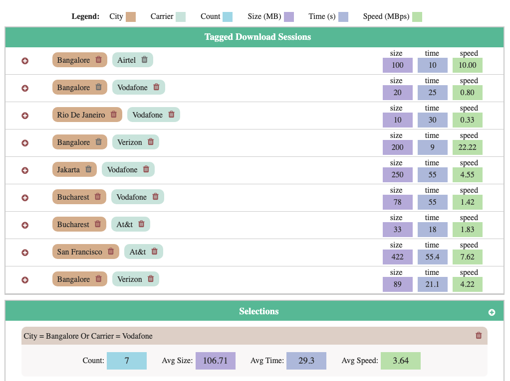

# Project - Interactive-Tags-Manipulation
An interface that allows interactive manipulation of tagging objects for download sessions and creates selections based on tags in the download sessions.

## Data Description
 * "Download sessions" represent testing data downloads on mobile networks all over the world and has a size, a duration (time), and list of tags.
 * "Selections" allow to monitor download sessions with certain tags in real-time and contain a list of tags.

## Tasks Supported by UI

The interface show allow performing the following actions.
* Be able to add and delete a tag from a session.

* When a tag is added to a session, UI immediately updates the
statistics for any selections that include the session based on the
new tag.

* When a tag is deleted from a session, UI immediately updates the
statistics for any selections that included the session based on that
tag.

* When the mouse hovers a selection, its corresponding sessions get
visually highlighted in some way.

* Be able to delete a selection.

* Be able to create a new selection. When the new selection is created,
it immediately updates with statistics, if there are any objects that
pass its filter.

